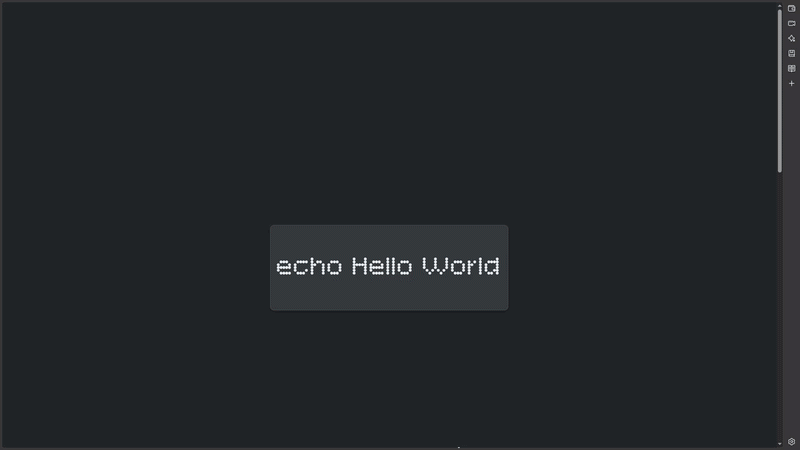

# echo Portfolio

A website that showcases who I am and projects I have made.

# Website

Here is the link to my website: 
https://hypersonicyunus.github.io/myportfolio/ 

   

# Details about this project

This project inclues:
- A Title
- A bio/brief description of me
- An area of boxes that showcase my projects

I used basic HTML & CSS to make this project. I also utilised Google fonts for styling my website.

# AI Usage
I used AI to help learn html and css, some formatting and some debugging. Most of the code was made by me, with the assistance of AI.
